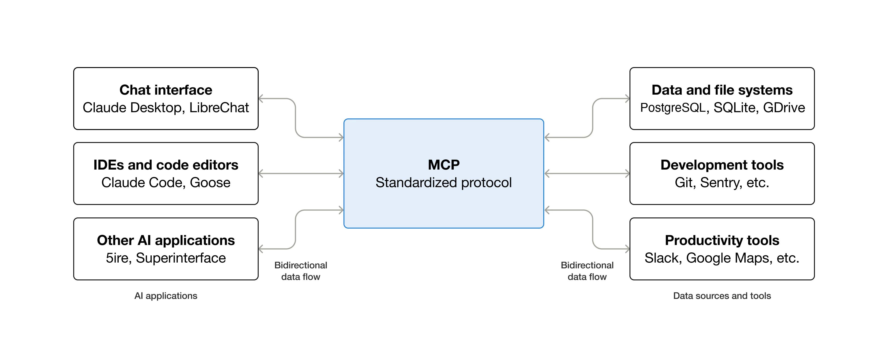
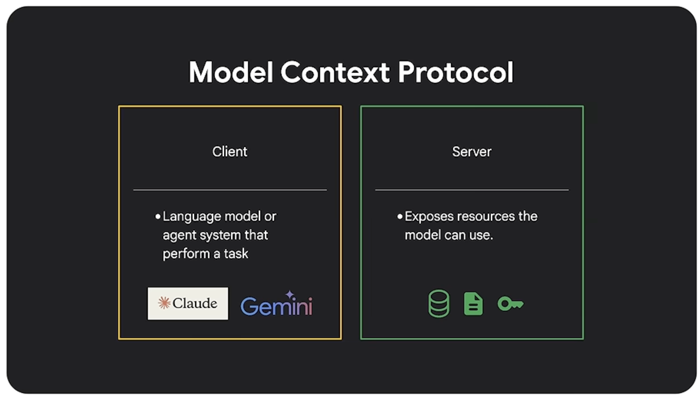
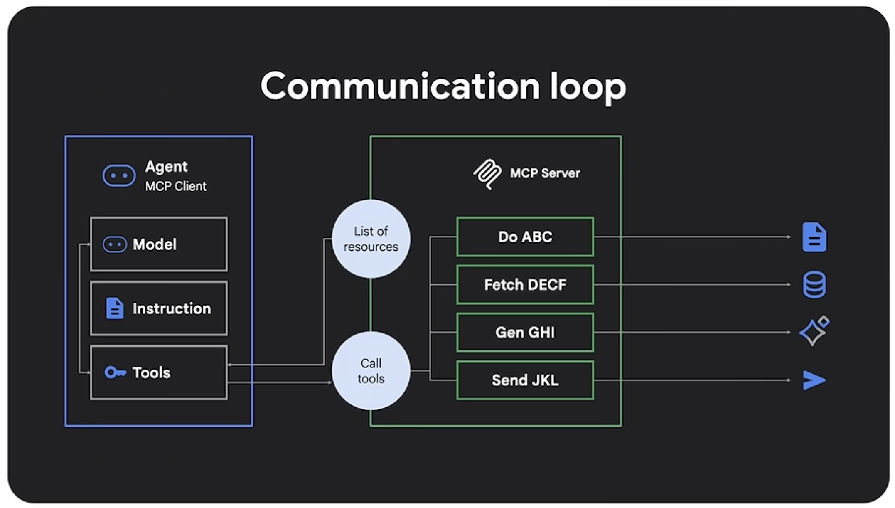
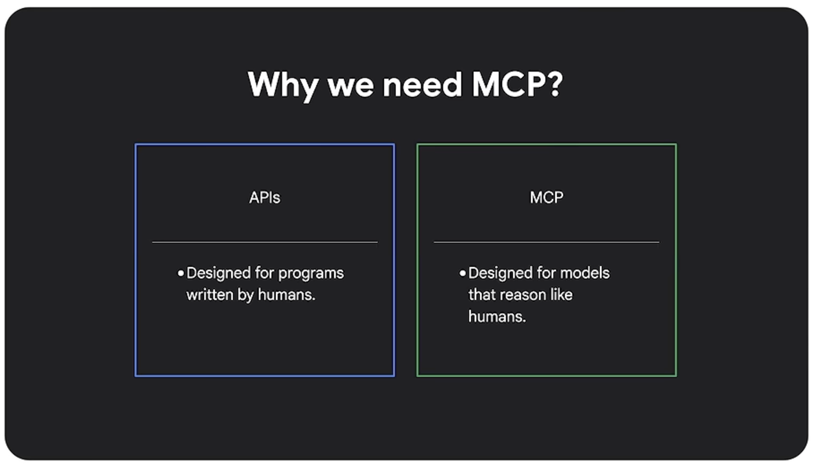

#  What is the Model Context Protocol (MCP)?

https://modelcontextprotocol.io/docs/getting-started/intro

MCP (Model Context Protocol) is an open-source standard for connecting AI applications to external systems eg tools, data and context in a consistent and structured way.

{#fig-mcp width="15cm"}

Using MCP, AI applications like Gemini, Claude or ChatGPT can connect to data sources (e.g. local files, databases), tools (e.g. search engines, calculators) and workflows (e.g. specialized prompts)—enabling them to access key information and perform tasks.

Think of MCP like a USB-C port for AI applications. Just as USB-C provides a standardized way to connect electronic devices, MCP provides a standardized way to connect AI applications to external systems.

{#fig-mcp width="15cm"}

The client is the language model (Claude or Gemini) or agent system that wants to perform the task. The server is the environment that exposes resources the model can use eg database, file system or internal tools.

When the client connects to the server, the server doesn't jsut respond with data, instead it advertises what capabilities it supports, what resources exist, what actions can be taken and what inputs are required. This means that the model doesn't need to be pre-programmed with every API or every endpoint. It can dynamically discover them. 

JSON response:

- what's possible
- what happened

## What can MCP enable?

- Agents can access your Google Calendar and Notion, acting as a more personalized AI assistant.
- Claude Code can generate an entire web app using a Figma design.
- Enterprise chatbots can connect to multiple databases across an organization, empowering users to analyze data using chat.
- AI models can create 3D designs on Blender and print them out using a 3D printer.

## Why does MCP matter?

- Developers: MCP reduces development time and complexity when building, or integrating with, an AI application or agent.
- AI applications or agents: MCP provides access to an ecosystem of data sources, tools and apps which will enhance capabilities and improve the end-user experience.
- End-users: MCP results in more capable AI applications or agents which can access your data and take actions on your behalf when necessary.

### Pain points

- Models talk to tools is messy
- APIs behave differently
- Integratation needs custom code
- Model changes, connection breaks

APIs were built for deterministic programs, but AI models reason probabilistically. So how do you get your AI agents to talk to your tools and data without writing messy, custom integration code every time? Enter the Model Context Protocol (MCP) shown in @fig-mcp. In this video, Smitha Kolan explains what MCP is, how it standardizes the way AI models discover and interact with external resources, and why it's becoming the new standard over traditional APIs for AI-powered applications

{#fig-mcp width="15cm"}

**MCP defines resources**:

- tools
    - actions that the model can invoke
    - search database, send email, analyze file
- resources
    - pieces of data or state
    - text document, database row, image
- prompts
    - reusable templates to solve specific tasks
- context
    - represents useful external information

The protocol enforces a consistent schema across all tools.

{#fig-mcp width="15cm"}

If we already have APIs, why do we need MCP?

APIs were designed for programs written by humans. MCP is designed for models that reason like humans. MCP is an abstraction above APIs. APIs still exist. MCP makes APIs model friendly. **Model only interacts with structured MCP schema which handles discovery, validation and execution in a uniform way**.